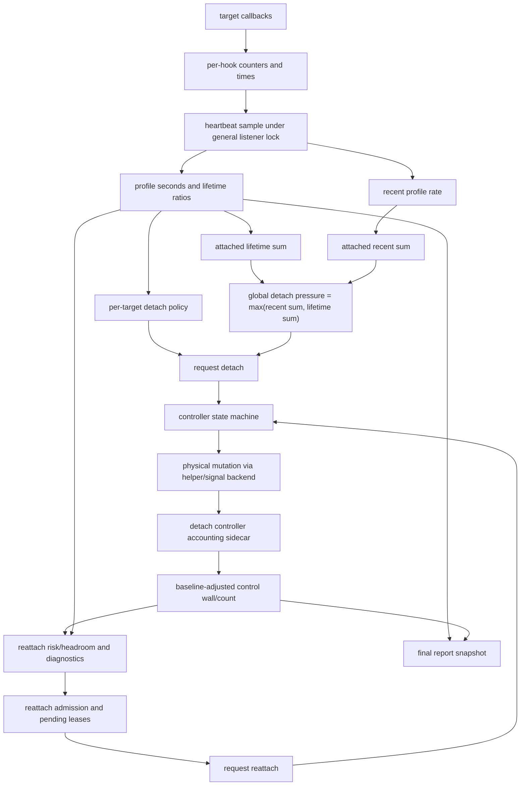

# Heartbeat Mechanism and Runtime Policy

This document is the user- and developer-facing guide to the current heartbeat
implementation. It explains runtime behavior, accounting dataflow, policy, and
tuning.

The [physical detach controller](physical-detach-controller.md) is the detailed
mutation-safety design. It owns helper/signal backend semantics, PC
classification, thread stopping, pthread creation gating, and
failure-after-mutation boundaries.

This page explains how the heartbeat thread uses those mechanisms today.

## Lifecycle

`peak_init()` parses the heartbeat policy environment along with the target
configuration. If PEAK has no requested work, initialization returns before
starting listeners or the heartbeat.

For target profiling work, initialization proceeds in this order:

1. Attach pthread bookkeeping.
2. Optionally warm up the detach backend when target hooks exist and MPI was
   not detected.
3. Attach MPI and CUDA support surfaces when enabled.
4. Allocate target listener bookkeeping and attach the general listener.
5. Attach syscall support and, if needed, the dynamic `dlopen` path.
6. Set `peak_main_time = peak_second()`.
7. Publish the runtime start and stop-window accounting baseline through
   `peak_general_listener_note_runtime_start()`.
8. If `PEAK_HEARTBEAT_INTERVAL` parsed to a nonzero value, allocate
   `heartbeat_overhead`, initialize `PeakHeartbeatArgs`, set
   `heartbeat_running = true`, and start `peak_heartbeat_monitor()`.

The runtime-start call is deliberately before heartbeat creation. It records the
elapsed-time denominator start and snapshots the current detach-controller
stop-window count and wall time. Heartbeat and reporting code subtract that
baseline from later control accounting.

Baseline validity is retained for the full run. If the bounded baseline read
cannot obtain a coherent tuple, later reads remain marked invalid even when the
current tuple is readable; reattach fails closed and final validation rejects
the arm. The zero baseline still charges any pre-runtime control cost
conservatively instead of hiding it.

`peak_fini_impl()` stops the heartbeat before freezing the final report:

1. If PEAK is running from the MPI-finalize path, suspend callbacks.
2. Set `heartbeat_running = false`, signal the heartbeat condition variable,
   and join the heartbeat thread.
3. Stop/join the general detach controller under its existing bounded drain and
   MPI-finalize policy.
4. Convert `peak_main_time` from a start timestamp to elapsed seconds.
5. Freeze the final report snapshot.
6. Free `heartbeat_overhead`, then continue support-hook and target teardown
   according to MPI/finalize safety.

The heartbeat cleanup path snapshots any remaining `heartbeat_overhead` before
the array can be freed, so final reporting can still include heartbeat profiling
cost after the heartbeat thread exits. The final report boundary includes every
control window completed before the controller join. Pending requests that the
existing MPI-finalize or timeout policy does not start have no stop-window cost;
later per-hook cleanup in `peak_general_listener_dettach()` is excluded.

## Dataflow



## Heartbeat Samples and Denominators

Each heartbeat iteration uses `total_execution_time = now - peak_main_time`,
clamped to a tiny positive value. The same application-start denominator also
feeds final reporting after `peak_fini_impl()` converts `peak_main_time` to
elapsed seconds.

For each hook, the heartbeat samples total callback counts from all listener
thread slots. The calibrated callback cost is `peak_general_overhead`, measured
by temporarily attaching a dummy function when calibration is needed. Hook
profile seconds are:

```text
total_calls[i] * peak_general_overhead + heartbeat_overhead[i]
```

Detached and reattach-requested hooks can reuse a cached sample instead of
scanning live callback slots every heartbeat. Reattaching hooks are not reused,
so the first attached sample after a physical reattach is seeded from live
slots.

The heartbeat stores these per-hook snapshots:

- `calls_snapshot[i]`: total observed calls.
- `profile_seconds_snapshot[i]`: cumulative profile seconds for the hook.
- `lifetime_snapshot[i]`: cumulative hook profile ratio,
  `profile_seconds_snapshot[i] / total_execution_time`.
- `rate_snapshot[i]`: recent profile rate over the last heartbeat interval.
  Cached detached samples report zero recent rate for that cycle.

Recent baselines are advanced every heartbeat. When a hook is unavailable, the
baseline is reset so the next valid sample does not create a fake burst from an
unrelated old timestamp.

Control stop-window accounting has a separate denominator path. The detach
controller publishes cumulative stop-window count and wall time. The general
listener obtains a bounded, lock-free coherent snapshot and subtracts the
heartbeat/runtime baseline:

```text
control_spent_seconds =
  (accounting.stop_window_wall_ns - baseline_stop_window_wall_ns) / 1e9
stop_window_count =
  accounting.completed_stop_window_count - baseline_completed_stop_window_count
```

The raw spent ratio used by reporting and the reattach request context is:

```text
spent_ratio =
  (profile_spent_seconds + control_spent_seconds) / total_execution_time
```

Heartbeat management CPU time is tracked separately with
`CLOCK_THREAD_CPUTIME_ID` checkpoints around active policy work. It is reported
as diagnostics and is not added to detach pressure or reattach admission.

## Detach Signals

The detach side is profile-only. Completed stop-window wall time and heartbeat
management CPU do not create detach pressure.

Per-target detach uses cumulative profile lifetime:

```text
lifetime_ratio[i] > target_profile_ratio
```

The current code also requires at least two observed calls
(`PEAK_GLOBAL_DETACH_MIN_CALLS == 2`) before heartbeat detach requests are
created. This keeps one-call cold targets from being detached only because a
single expensive call crossed a ratio.

Global detach uses attached profile pressure:

```text
attached_recent_sum = sum recent_rate[i] for attached hooks
attached_lifetime_sum = sum lifetime_ratio[i] for attached hooks
profile_global_overhead = max(attached_recent_sum, attached_lifetime_sum)
```

If `profile_global_overhead` exceeds
`global_target_ratio * peak_global_detach_factor`, attached candidates are
ranked by `max(recent_rate, lifetime_ratio)`, then by recent rate and index.
After each accepted detach request, the heartbeat debits the local projected
recent and lifetime sums and stops once the projected global overhead is at or
below `global_target_ratio`.

The request context records the call count, lifetime ratio, global profile
pressure, elapsed time, and recent rate that caused the request. It does not
perform the mutation. The controller owns mutation ordering.

## Reattach Risk Scaling

Node-local rank scaling is a policy input only for reattach admission. The same
scaled value is also emitted as a reporting diagnostic; it does not affect
detach decisions or hook state.

At heartbeat thread startup, the code reads a local MPI rank count from the
first positive integer in:

```text
MPI_LOCALNRANKS
OMPI_COMM_WORLD_LOCAL_SIZE
MV2_COMM_WORLD_LOCAL_SIZE
PMI_LOCAL_SIZE
```

If none of these are valid, the fallback is exactly `1`. That fallback is not
conservative when more than one MPI rank actually shares a node. PEAK does not
independently verify launcher topology, so the scaled estimate is conservative
only when this metadata accurately reports the local rank count.

Reattach computes:

```text
raw_control_spent_seconds = completed local stop-window wall since baseline
reattach_control_risk_seconds =
  raw_control_spent_seconds * local_mpi_ranks
reattach_spent_seconds =
  profile_spent_seconds + reattach_control_risk_seconds
reattach_risk_spent_ratio =
  reattach_spent_seconds / total_execution_time
reattach_gate_ratio =
  peak_global_reattach_factor * global_target_ratio
```

A reattach wave starts only when `reattach_risk_spent_ratio <=
reattach_gate_ratio`. The local-rank multiplier does not feed per-target detach,
global detach, adaptive sleep, hook state, cooldown, controller state, or the
request context. With valid local-rank metadata, it is a conservative same-node
admission estimate for reattach.

If the controller accounting snapshot cannot be proven valid, reattach admission
rejects the wave for that heartbeat. A failed current read renders a finite zero
fallback; invalid baseline provenance may render the current tuple
conservatively. Both cases mark `snapshot_valid=0`, and neither renders sentinel
values as measurements.

The raw report and the risk report are intentionally separate. Raw control wall
is measured process-local wall time. With valid local-rank metadata, risk
control is a same-node exposure estimate. Neither is a synchronized MPI-wide
runtime overhead proof.

## Reattach Cooldown, Admission, and Reservations

`PEAK_ENABLE_REATTACH` defaults to enabled when unset, but reattach only runs
when the heartbeat is enabled, `PEAK_HIBERNATION_CYCLE` is nonzero, and either
per-target or global heartbeat policy is enabled.

The default reattach cooldown in the current implementation is 60 seconds:

```c
static const unsigned int peak_reattach_default_cooldown_ms = 60000;
```

`peak_general_listener_init_reattach_policy_once()` reads the cooldown before
the first eligibility check. `PEAK_REATTACH_COOLDOWN_MS=0` disables the
cooldown and is used by several focused tests.

A reattach candidate must still be:

- published;
- physically/logically detached;
- not marked `peak_need_detach`;
- in `PEAK_HOOK_DETACHED`;
- past cooldown;
- eligible under per-target policy, global policy, or both.

Per-target reattach eligibility requires the current projected profile ratio to
be at or below `target_profile_ratio`. Global reattach eligibility is present
when global heartbeat policy is enabled.

The projected profile seconds for a detached hook are conservative:

```text
projected_seconds[i] =
  max(saved_detach_profile_seconds[i],
      current_observed_profile_seconds[i])
projected_ratio[i] =
  projected_seconds[i] / total_execution_time
historical_rate[i] =
  projected_seconds[i] / total_execution_time
```

`saved_detach_profile_seconds` is recorded after successful detach from the
request context (`request_ratio * request_total_time`) or from a current/fallback
sample. This preserves the historical cost that justified detach, while still
allowing the ratio to decay as elapsed time grows.

Admission is expressed in seconds:

```text
headroom_seconds =
  global_target_ratio * total_execution_time
  - profile_spent_seconds
  - local_mpi_ranks * raw_control_spent_seconds
  - pending_reattach_future_leases
  - local_mpi_ranks * predicted_pending_batch_stop_seconds
```

Pending reattach reservations are charged before adding new candidates. For a
pending reattach, the code uses the pending request rate when available;
otherwise it falls back to the current historical rate. The future lease uses
the current observation horizon:

```text
lease_seconds = request_rate * (hb_max_us / 1e6)
```

Stop-window prediction uses only
`peak_detach_controller_last_stop_window_us()`, scaled by local ranks for
reattach risk. Completed count/wall averages are not used as a predictive
policy input. Cumulative completed stop-window wall remains spent through the
control accounting sidecar.

The heartbeat holds the general listener lock while it snapshots pending
state, gathers detached candidates, subtracts pending reservations, sorts
eligible candidates, revalidates each candidate, and enqueues accepted reattach
requests. This prevents API/callback pending requests from crossing into the
same batch boundary without being charged.

Batch accounting uses `PEAK_GENERAL_CONTROLLER_MAX_BATCH_CANDIDATES == 64`.
The heartbeat estimates when a newly admitted request would create an
additional controller batch window and adds only that incremental predicted stop
cost to the candidate.

## Controller Boundary

The heartbeat never calls Gum lifecycle APIs. It only calls the request helpers
under the general listener lock:

- `peak_general_listener_request_detach_with_context_unlocked()`
- `peak_general_listener_request_reattach_with_context_unlocked()`

Those helpers only accept transitions that match the current state:

```text
ATTACHED -> DETACH_REQUESTED
DETACHED -> REATTACH_REQUESTED
```

Already-requested or in-progress same-direction transitions coalesce and return
success. Other states reject the request. Reattach also rejects a hook whose Gum
detach did not flush.

The controller thread is the mutation boundary. In strict-batch mode it:

1. Collects pending detach/reattach candidates.
2. Builds `PeakDetachRequest` records.
3. Calls `peak_detach_controller_prepare_hook_mutation_batch()`.
4. Moves prepared hooks to `DETACHING` or `REATTACHING`.
5. Performs only the Gum work needed for non-physical fallback paths.
6. Calls `peak_detach_controller_finish_hook_mutation_batch()`.
7. Publishes stable states and transition coverage markers.
8. Records traces and resets retry/pending context.

Retryable prepare failures keep the transition pending with exponential
backoff. The current constants are 1 ms base delay, 50 ms maximum delay, 300
maximum retries, and 30 seconds maximum pending age. Exceeding either retry
budget abandons only the unproven transition: failed detach leaves the hook
attached, and failed reattach leaves it detached.

During MPI finalization, `peak_general_listener_note_mpi_finalize_requested()`
prevents new detach/reattach requests and the controller processing path returns
without doing new work.

For detailed backend safety behavior, see
[Physical detach controller](physical-detach-controller.md).

## Stop-Window Accounting Sidecar

The detach controller maintains a sidecar:

```c
typedef struct {
    uint64_t completed_stop_window_count;
    uint64_t failed_stop_window_count;
    uint64_t stop_window_wall_ns;
} PeakDetachAccountingSnapshot;
```

The control-window interval starts immediately before the selected backend
issues STOP. A completed window ends after PEAK has proven the stopped threads
were released or cleanup completed. For helper-backed physical mutation, this
covers helper STOP, classification/evacuation, mutation, and release/cleanup;
signal and fallback paths cover the equivalent local protocol. This is a
controller disruption wall-time upper bound. It is not an exact simultaneous
all-thread pause duration, and it must not be interpreted as an MPI-wide
synchronized pause.

At control-window start, the controller stores a monotonic timestamp. At a
proven release/cleanup finish, it converts elapsed wall time to nanoseconds,
adds it to `stop_window_wall_ns`, increments
`completed_stop_window_count`, and publishes `last_stop_window_us` for the
batch-cost predictor. Completion describes the STOP-to-release control window,
not the hook mutation result: a Gum attach/detach failure after safe release is
still a completed window and remains a valid cost sample. If STOP,
classification, evacuation, or release reaches a
reportable failure, the elapsed time is still added to
`stop_window_wall_ns` and `failed_stop_window_count` is incremented. A failed
window does not overwrite the last successful predictor sample. Unrecoverable
failures that cannot prove thread release still terminate the process through
the existing fail-closed path. These counters are accounting-only and do not
change retry or cleanup behavior.

`peak_detach_controller_accounting_snapshot()` is lock-free and read-only. It
does not allocate, log, call Gum, or take the mutation guard. This makes it safe
for heartbeat and reporting to sample completed control cost without
participating in the mutation lifecycle.

The count and wall-time fields use a bounded sequence snapshot. If repeated
writer contention prevents a coherent read, the snapshot API returns `FALSE`
without modifying the caller's output. General-listener callers initialize the
output to a finite zero fallback, while reattach uses the validity result and
fails closed for that heartbeat.

The trace setting is independent. `PEAK_DETACH_TRACE_PATH` is cached by the
general listener and passed to
`peak_detach_controller_configure_trace_diagnostics()`, but the count/wall
sidecar and `last_stop_window_us` are not gated by trace diagnostics.

No-trace coverage exists in the fake-helper controller test: it unsets
`PEAK_DETACH_TRACE_PATH`, verifies `last_stop_window_us` is zero immediately
after prepare, finishes detach and reattach, and then checks that the completed
stop-window count/wall and last-window value were published. The static
lifecycle check also asserts that stop-window accounting is not trace-gated.

## Adaptive Sleep

The heartbeat sleeps once before the first sample using:

```text
clip(heartbeat_time, hb_min_us, hb_max_us)
```

After each policy cycle, sleep is adaptive. The signal is the same
profile-only `profile_global_overhead` used by global detach, not reattach
risk:

```text
global_rate =
  (profile_global_overhead - previous_profile_global_overhead) / dt
ema_global_rate =
  hb_ema_a * global_rate + (1 - hb_ema_a) * previous_ema
err =
  max(profile_global_overhead / global_target_ratio - 1, 0)
scale =
  1 / (1 + hb_k_err * err + hb_k_rate * ema_global_rate)
sleep_us =
  clip(heartbeat_time * scale, hb_min_us, hb_max_us)
```

Timed sleep is excluded from heartbeat-management CPU accounting. The wait uses
a condition variable so shutdown can wake the heartbeat promptly.

## Reporting

Reporting uses `peak_general_listener_freeze_final_report_snapshot()` after the
heartbeat and controller threads have joined. That snapshot contains:

- baseline-adjusted stop-window count;
- baseline-adjusted failed control windows;
- accounting snapshot validity;
- elapsed seconds;
- profile seconds;
- raw control seconds;
- heartbeat management CPU seconds;
- profile ratio;
- control ratio;
- raw profile+control ratio;
- local-rank-scaled profile+control risk ratio;
- local-rank-scaled control risk ratio;
- management ratio.

Single-process and rank-local output print the `local` stop-window label.
Aggregate MPI/socket output prints per-rank maximum ratios where applicable and
uses `rank-0/local` for the root rank's local stop-window count and wall. The
stop-window report uses the same baseline-adjusted values:

```text
[peak] local control stop-window overhead: windows=N wall_seconds=S ratio=R
[peak] rank-0/local control stop-window overhead: windows=N wall_seconds=S ratio=R
```

Failed-window diagnostics are separate so the completed-window line stays
parsable:

```text
[peak] local failed control windows: windows=N snapshot_valid=0|1
[peak] aggregate failed control windows: windows=N snapshot_valid=0|1
```

MPI and socket aggregation sum the failed-window count and require a valid
final snapshot from every rank. The completed-window wall metric remains
explicitly rank-0/local because heartbeat accounting itself is not MPI
synchronized.

Transition coverage is also reported:

```text
detached_targets=N reattached_targets=N revisited_targets=N
```

`revisited_targets` marks hooks that were detached, successfully reattached,
and then accumulated additional profiled calls after the reattach request
baseline.

CSV output remains per-function profile data. The text report is where the
profile/control/risk/management split is currently visible.

## Environment Variables and Defaults

The defaults below describe the current implementation.

| Variable | Default | Effect |
| --- | ---: | --- |
| `PEAK_HEARTBEAT_INTERVAL` | `0.1` seconds | Base heartbeat interval. Parsed to microseconds. `0` disables the heartbeat thread. |
| `PEAK_HIBERNATION_CYCLE` | `50` | Reattach cadence: reattach runs every N heartbeat cycles when nonzero. |
| `PEAK_OVERHEAD_RATIO` | `0.1` | Per-target lifetime profile ratio threshold. |
| `PEAK_GLOBAL_OVERHEAD_RATIO` | `0.1` | Global profile target and reattach headroom target. |
| `PEAK_GLOBAL_DETACH_FACTOR` | `1.2` | Global detach hysteresis multiplier. |
| `PEAK_GLOBAL_REATTACH_FACTOR` | `0.85` | Reattach spent-risk gate multiplier. |
| `PEAK_ENABLE_PER_TARGET_HEARTBEAT` | `false` | Enables per-target heartbeat detach and per-target reattach eligibility. |
| `PEAK_ENABLE_GLOBAL_HEARTBEAT` | `false` | Enables global heartbeat detach and global reattach eligibility. |
| `PEAK_ENABLE_REATTACH` | enabled when unset | Enables heartbeat reattach when other cadence/policy gates are satisfied. Set false/0 to disable. |
| `PEAK_REATTACH_COOLDOWN_MS` | `60000` | Minimum time after successful detach before heartbeat may reattach that hook. `0` disables cooldown. |
| `PEAK_HB_MIN_US` | `10000` | Lower bound for adaptive heartbeat sleep. |
| `PEAK_HB_MAX_US` | `500000` | Upper bound for adaptive heartbeat sleep and the reattach future-lease horizon. If less than min, it is raised to min. |
| `PEAK_HB_K_ERR` | `3.0` | Adaptive-sleep error gain. |
| `PEAK_HB_K_RATE` | `0.8` | Gain on the EMA of global profile-pressure growth. |
| `PEAK_HB_EMA_A` | `0.3` | Adaptive-sleep EMA weight. Invalid values outside `(0, 1]` reset to `0.3`. |
| `PEAK_MAX_NUM_THREADS` | `2 * online CPUs` | Size of per-listener thread slots used for callback counters. |
| `PEAK_COST` | `0` | Enables count-based detach using calibrated callback cost when positive. |
| `PEAK_DETACH_COUNT` | unset | Overrides count-based detach threshold when set to a positive integer. |
| `PEAK_CONTROLLER_MAX_PENDING_AGE_MS` | `30000` | Maximum pending age before abandoning a retrying transition. `0` disables age limit. |
| `PEAK_CONTROLLER_MAX_RETRY_COUNT` | `300` | Maximum retry count before abandoning a retrying transition. `0` disables count limit. |
| `PEAK_DETACH_TRACE_PATH` | unset | Enables transition trace rows. Accounting still runs when unset. |
| `PEAK_TEXT_OUTPUT` | auto | Truthy values force text output. Without it, rank-local MPI-shaped output may suppress duplicate text. |
| `PEAK_OUTPUT_AGGREGATION` | `mpi` under MPI | Selects `mpi`, `socket`, or local/rank-local aggregation. |
| `PEAK_MPI_COLLECTIVE_OUTPUT` | unset | Legacy alias used when `PEAK_OUTPUT_AGGREGATION` is unset. |
| `PEAK_MPI_FINALIZE_REQUEST_TIMEOUT_MS` | `10000` | Timeout for all-rank finalize participation proof. |
| `PEAK_MPI_OUTPUT_AGGREGATION_TIMEOUT_MS` | `5000` | Timeout for MPI output reducer collectives. |
| `PEAK_OUTPUT_AGGREGATION_TIMEOUT_MS` | `60000` | Timeout for socket aggregation. |
| `PEAK_MPI_REPORT_RELEASE_TIMEOUT_MS` | `180000` | Timeout for the common post-publication release gate; keep it above twice any configured socket timeout plus local-fallback margin. |
| `MPI_LOCALNRANKS`, `OMPI_COMM_WORLD_LOCAL_SIZE`, `MV2_COMM_WORLD_LOCAL_SIZE`, `PMI_LOCAL_SIZE` | `1` fallback | Local rank count for reattach admission and diagnostic risk reporting. |

Several backend safety variables, such as `PEAK_SAFE_DETACH_MODE`,
`PEAK_DETACH_BACKEND`, `PEAK_DETACH_HELPER`, signal reservation controls, and
strict pthread-gate timeout controls, are documented in the
[physical detach controller guide](physical-detach-controller.md).

## MPI Limitations

The heartbeat thread performs no MPI synchronization. During the run it uses
only local process counters, local stop-window accounting, and local-rank count
metadata from environment variables. The node-local risk ratio is therefore an
admission heuristic for same-node exposure, not a proof of MPI-wide
application-observed overhead.

MPI enters the picture during teardown/reporting:

- `peak.c` requires an all-rank finalize-participation proof before using MPI
  collectives for output on the finalize path.
- MPI reducer calls use bounded nonblocking collectives. If a payload reduction
  fails after the proof, PEAK first attempts its socket fallback without further
  MPI calls when that fallback is enabled, then writes rank-local output if the
  socket path is unavailable or fails.
- Explicit socket aggregation and rank-local output publish their frozen CPU
  report before the finalize-participation proof. The strict socket path uses
  consistent launcher rank/size pairs and makes no MPI call until publication
  and socket release are finished. The later proof only decides whether PEAK
  may enter the common release gate and real finalizer. With explicit
  `PEAK_MPI_FINALIZE_POLICY=defer`, socket output instead uses a process-exit
  path that does not require an MPI-finalize proof.
- On the default pre-finalize path, MPI, socket, and rank-local writers all
  enter a bounded post-publication gate. Its reduction distinguishes output
  failure from protocol failure. Ranks that complete the same gate observe one
  reduced real-finalizer policy, but a local collective error or timeout cannot
  prove that every peer observed the same failure; that path is locally
  fail-closed rather than distributed failure consensus.
- Healthy runtimes other than Intel MPI 2019 normally return to the real
  `PMPI_Finalize()` after the release gate. Intel MPI 2019 skips its observed
  crash-prone finalizer by default; `PEAK_MPI_REAL_FINALIZE=1` explicitly opts
  back in. Unless `PEAK_MPI_REAL_FINALIZE=0`, `defer` calls the real finalizer
  before this compatibility policy and therefore bypasses it. Skipping the
  finalizer is non-conforming and still requires launcher-scale validation.
- An abnormal exit uses rank-local output without making teardown MPI calls.
  Missing all-rank participation rejects MPI aggregation. A local/socket report
  already published before a failed or timed-out proof is retained; PEAK then
  fails the MPI finalizer path closed without issuing later MPI calls.

PEAK does not call full teardown from a termination-signal handler. `SIGKILL`
cannot be caught, and `peak_fini()` uses locks, threads, allocators, I/O, and
optional MPI operations that are not async-signal-safe. CSV publication instead
uses a same-directory temporary file plus atomic rename: after abrupt process
termination the final pathname is absent or complete, while an interrupted
pre-rename writer may leave a temporary file. This is a process-level atomicity
guarantee, not a guarantee of an exact final snapshot under arbitrary kill,
launcher abort, node loss, or power loss.

## Testing and Diagnostics

Useful local checks for this mechanism include:

- `test_detach_lifecycle_invariants`: static checks for heartbeat accounting,
  reattach admission shape, trace caching, and controller boundaries.
- `test_detach_controller_fake_helper_trace_disabled_stop_window`: covers
  stop-window count/wall/last-window publication without
  `PEAK_DETACH_TRACE_PATH` when the patched Gum PC API is available.
- `test_detach_hotloop_batch_reattach_strict`,
  `test_detach_hotloop_reattach_cooldown_strict`, and
  `test_detach_hotloop_observed_overhead_reattach_guard_strict`: focused
  runtime checks for strict heartbeat reattach policy.
- `test_detach_milc_like_reattach_redetach_strict` and related MILC-like
  harnesses: checks for detach, reattach, redetach, and final-report parsing.
  This named test permits zero revisited targets and is mechanism coverage
  rather than a full acceptance test.

Trace rows, when enabled, are diagnostics. They append request provenance,
retry state, stop-window details, batch ids, and accounting fields. They do not
control whether stop-window accounting exists.
